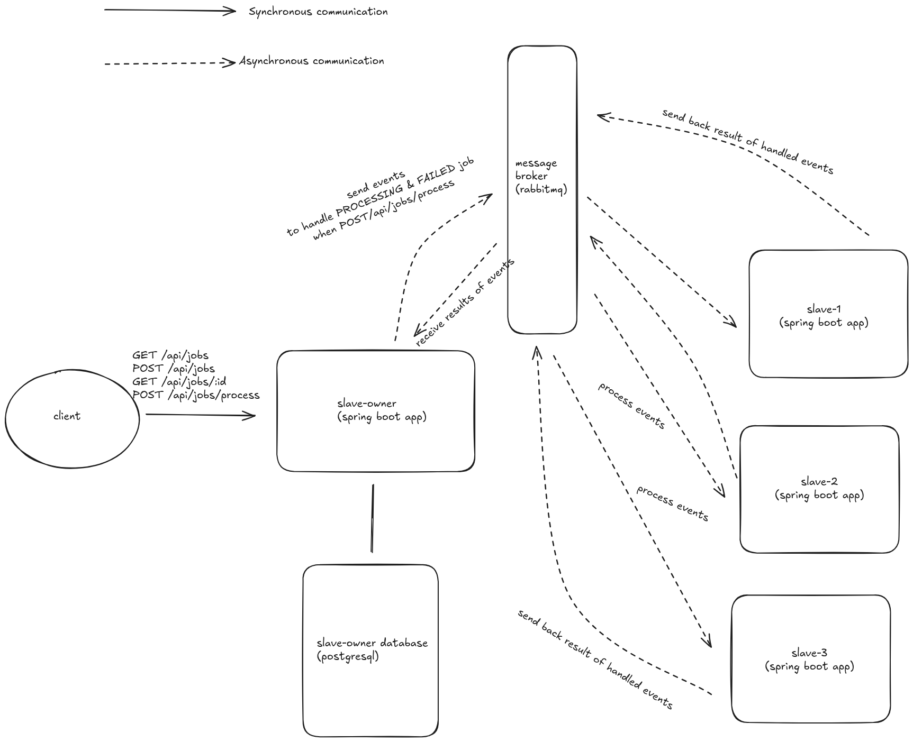
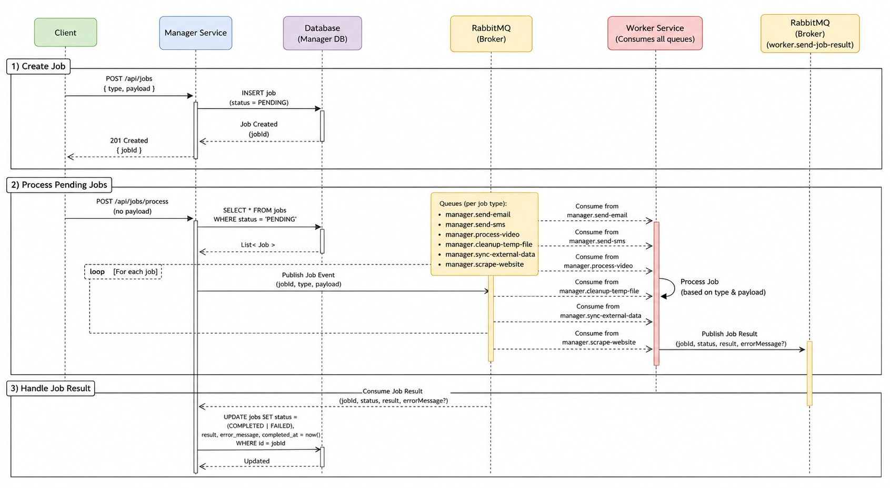

# Overall architecture & walkthrough

## Overall architecture



## Tech stack

- Spring boot 3.5.16 and java 21
- Postgresql 18.6
- Rabbitmq 4.x

## How job type impact the architecture

- In order to demonstrate the solution better, I created 6 different job types, the enum below reflects that

  `EJobType.java`
  ```java
  public enum EJobType {
      SEND_EMAIL,
      SEND_SMS,
      PROCESS_VIDEO,
      CLEANUP_TEMP_FILES,
      SYNC_EXTERNAL_DATA,
      SCRAPE_WEBSITE,
      UNKNOWN,
      ;

      public static EJobType fromStr(String type) {
          if (ObjectUtils.isEmpty(type)) return UNKNOWN;
          try {
              return EJobType.valueOf(StringUtils.upperCase(type));
          } catch (IllegalArgumentException e) {
              return UNKNOWN;
          }
      }

  }
  ```
- Each job type will have their own request class and still follow one common request interface:

  `SendEmailRequest.java`
  ```java
  @Data
  @Builder
  @NoArgsConstructor
  @AllArgsConstructor
  public class SendEmailRequest implements CreateJobRequest {

      private Payload payload;

      @Override
      public String getType() {
          return SEND_EMAIL.name();
      }

      @Override
      public CreateJobRequestPayload getPayload() {
          return payload;
      }

      @Data
      @NoArgsConstructor
      @AllArgsConstructor
      @Builder
      public static class Payload implements CreateJobRequestPayload {
          private String recipient;
          private String subject;
          private String body;
          private Boolean fail;
      }

  }
  ```

  `SendSmsRequest.java`
  ```java
  @Data
  @Builder
  @NoArgsConstructor
  @AllArgsConstructor
  public class SendSmsRequest implements CreateJobRequest {

      private Payload payload;

      @Override
      public String getType() {
          return SEND_SMS.name();
      }

      @Override
      public CreateJobRequestPayload getPayload() {
          return payload;
      }

      @Data
      @NoArgsConstructor
      @AllArgsConstructor
      @Builder
      public static class Payload implements CreateJobRequestPayload {
          private String phoneNumber;
          private String message;
          private Boolean fail;
      }

  }
  ```

  `ScrapeWebsiteRequest.java`
  ```java
  @Data
  @Builder
  @NoArgsConstructor
  @AllArgsConstructor
  public class ScrapeWebsiteRequest implements CreateJobRequest {

      private Payload payload;

      @Override
      public String getType() {
          return SCRAPE_WEBSITE.name();
      }

      @Override
      public CreateJobRequestPayload getPayload() {
          return payload;
      }

      @Data
      @NoArgsConstructor
      @AllArgsConstructor
      @Builder
      public static class Payload implements CreateJobRequestPayload {
          private String url;
          private List<String> keywords;
          private Boolean fail;
      }

  }
  ```

- Please help to take a look for the rest of requests in `sanlab.itv.nakivojpshared.request` package, below are the common request interface

  `CreateJobRequest.java`
  ```java
  @JsonTypeInfo(
    use = JsonTypeInfo.Id.NAME,
    property = "type",
    visible = true
  )
  @JsonSubTypes({
    @JsonSubTypes.Type(value = SendEmailRequest.class, name = "SEND_EMAIL"),
    @JsonSubTypes.Type(value = SendSmsRequest.class, name = "SEND_SMS"),
    @JsonSubTypes.Type(value = ProcessVideoRequest.class, name = "PROCESS_VIDEO"),
    @JsonSubTypes.Type(value = CleanupTempFileRequest.class, name = "CLEANUP_TEMP_FILES"),
    @JsonSubTypes.Type(value = SyncExternalDataRequest.class, name = "SYNC_EXTERNAL_DATA"),
    @JsonSubTypes.Type(value = ScrapeWebsiteRequest.class, name = "SCRAPE_WEBSITE"),
  })
  public interface CreateJobRequest {
      String getType();
      CreateJobRequestPayload getPayload();
  }
  ```

  `CreateJobRequestPayload.java`
  ```java
  public interface CreateJobRequestPayload {}
  ```

- Each job type will have their own queue:
  - SEND_EMAIL will have queue name `slave-owner.send-email`
  - SEND_SMS will have queue name `slave-owner.send-sms`
  - PROCESS_VIDEO will have queue name `slave-owner.process-sms`
  - CLEANUP_TEMP_FILES will have queue name `slave-owner.cleanup-temp-file`
  - SYNC_EXTERNAL_DATA will have queue name `slave-owner.sync-external-data`
  - SCRAPE_WEBSITE will have queue name `slave-owner.scrape-website`

- Each `slave` will *subscribe all queues*. For each queue, only one random subscriber slave will consume at a time so we don't have to worry about one queue message get consumed by multiple subscribers.

## Sequence diagram



- About the errata from the image: There are few erratas, because I use AI to generate this image so I cannot use strong words like `slave-owner` or `slave` (changed it to `manager` and `worker`) and few mistakes from the prompting details but overall, it still reflects the core idea.

## Request duplication handling approach

In order to prevent duplication from creating job request, whenever the new creating request comes, `slave-owner` service will hash the whole request payload (including job type field) with `SHA-256` and store as one field in job table. If the duplicated request comes, the service will query jobs by request hash string with status `PENDING` or `PROCESSING` to see if whether the job has already existed and will reject with status code `425` (Too early).

# Setup

## Run via docker compose

- Install docker & docker compose
- [At `./`] Clone `.env.template` file and rename it into `.env`
- [At `./dev-compose`] Run
  ```bash
  docker compose --env-file ../.env up
  ```
- Run `docker ps` and wait for statuses of all containers changed into `healthy`
- The `slave-owner` service is ready to go, it runs with host: `http://localhost:9090`

## Run locally

- Install docker, docker compose, maven & java 25
- [At `./`] Clone `.env.template` file and rename it into `.env`
- [At `./dev-compose`] comment out all `slave-owner` and `slave` containers from the `compose.yaml` file
- [At `./dev-compose`] Run
  ```bash
  docker compose --env-file ../.env up
  ```
- Run `docker ps` and wait for statuses of all containers changed into `healthy`
- [At `./`] Run `mvn clean package -DskipTests`
- Make sure `.env` get loaded into system environment
- [At `./`] Run `mvn spring-boot:run -pl nakivojp-slave-owner` for `slave-owner` and
  Run `mvn spring-boot:run -pl nakivojp-slave` for `slave`
- The `slave-owner` and `slave` service will run with host: `http://localhost:9090` and `http://localhost:9091`

## How to run automation testing

- Start application via docker compose or run it locally (recommended run via docker compose)
- Install nodejs and pnpm
- [At `./automation-testing`] Run `pmpm install` then `pnpm test` (Note that the database should be empty since this test insert many jobs for testing creating job feature)

## Request example

- GET /api/jobs
  ```bash
  curl --location 'http://localhost:9090/api/jobs?page=0&size=2&status=FAiLED'
  ```
- GET /api/jobs/:id
  ```bash
  curl --location 'http://localhost:9090/api/jobs/94a49d03-922e-4818-8545-eca157c34601'
  ```
- POST /api/jobs/process
  ```bash
  curl --location --request POST 'http://localhost:9090/api/jobs/process'
  ```
- POST /api/jobs
  ```bash
  curl --location 'http://localhost:9090/api/jobs' \
  --header 'Content-Type: application/json' \
  --data-raw '{
    "type": "SEND_EMAIL",
    "payload": {
      "recipient": "111@email.com",
      "body": "something something something",
      "subject": "Hello",
      "fail": true
    }
  }'
  ```
  ```bash
  curl --location 'http://localhost:9090/api/jobs' \
  --header 'Content-Type: application/json' \
  --data '{
    "type": "SEND_SMS",
    "payload": {
      "message": "Authentication for something",
      "phoneNumber": "00080111"
    }
  }'
  ```
  ```bash
  curl --location 'http://localhost:9090/api/jobs' \
  --header 'Content-Type: application/json' \
  --data '{
    "type": "CLEANUP_TEMP_FILES",
    "payload": {
      "directory": "/1/2/3",
      "fail": true
    }
  }'
  ```
  ```bash
  curl --location 'http://localhost:9090/api/jobs' \
  --header 'Content-Type: application/json' \
  --data '{
    "type": "PROCESS_VIDEO",
    "payload": {
      "videoUrl": "s3://bucket/input.mp4",
      "outputFormat": "mp4_1080p",
      "webhookUrl": "https://api.yourservice.com/webhooks/video-done",
      "fail": true
    }
  }'
  ```
  ```bash
  curl --location 'http://localhost:9090/api/jobs' \
  --header 'Content-Type: application/json' \
  --data '{
    "type": "SCRAPE_WEBSITE",
    "payload": {
      "url": "https://example.com",
      "keywords": ["hello", "world", "1", "2"],
      "fail": true
    }
  }'
  ```
  ```bash
  curl --location 'http://localhost:9090/api/jobs' \
  --header 'Content-Type: application/json' \
  --data '{
    "type": "SYNC_EXTERNAL_DATA",
    "payload": {
      "apiEndpoint": "https://example.com",
      "authToken": "1234",
      "fail": true
    }
  }'
  ```

# Assignment questions & answers
1. Suppose this service needs to support 1 million jobs per day and multiple application instances running in parallel.
   How would you improve the current design for production use?

    This architecture design is already production-grade and could serve a million jobs per day.

2. The jobs table has 50 million records. GET /api/jobs?status=PENDING&page=0&size=20 becomes slow. How
   would you investigate the issue and improve the performance?

    This is the current query for this api
    ```java
    @Query(value = """
      SELECT j FROM Job j
      WHERE :status IS NULL OR :status = '' OR j.status = :status
      ORDER BY j.createdAt DESC
    """, countQuery = """
      SELECT COUNT(DISTINCT j) FROM Job j
      WHERE :status IS NULL OR :status = '' OR j.status = :status
    """)
    Page<Job> getAllByStatus(@Param("status") String status, Pageable pageable);
    ```
    The simplest solution is creating index for `status` and `createdAt`
    ```sql
    CREATE INDEX CONCURRENTLY idx_job_status_created_at ON job (status, created_at DESC)
    ```
    If it is still slow, we have to check whether we need the whole job object, we could write a custom query to return only necessary fields for the client.
